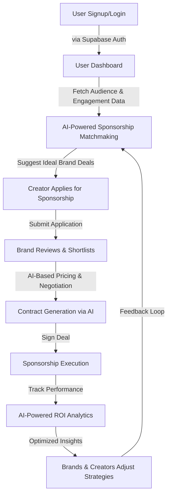
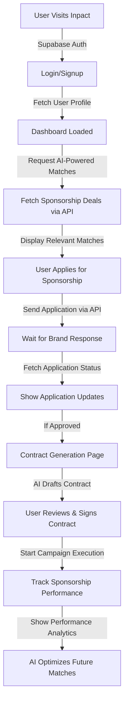
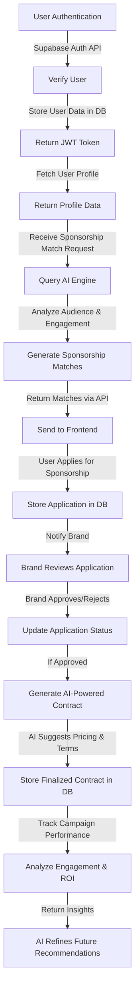

# Inpact - AI-Powered Creator Collaboration & Sponsorship Matchmaking

Inpact is an open-source AI-powered platform designed to connect content creators, brands, and agencies through data-driven insights. By leveraging Generative AI (GenAI), audience analytics, and engagement metrics, Inpact ensures highly relevant sponsorship opportunities for creators while maximizing ROI for brands investing in influencer marketing.

## Features

### AI-Driven Sponsorship Matchmaking
- Automatically connects creators with brands based on audience demographics, engagement rates, and content style.

### AI-Powered Creator Collaboration Hub
- Facilitates partnerships between creators with complementary audiences and content niches.

### AI-Based Pricing & Deal Optimization
- Provides fair sponsorship pricing recommendations based on engagement, market trends, and historical data.

### AI-Powered Negotiation & Contract Assistant
- Assists in structuring deals, generating contracts, and optimizing terms using AI insights.

### Performance Analytics & ROI Tracking
- Enables brands and creators to track sponsorship performance, audience engagement, and campaign success.

## Tech Stack
- **Frontend**: ReactJS
- **Backend**: FastAPI
- **Database**: Supabase
- **AI Integration**: GenAI for audience analysis and sponsorship recommendations

---

## Workflow

### 1. User Registration & Profile Setup
- Creators, brands, and agencies sign up and set up their profiles.
- AI gathers audience insights and engagement data.

### 2. AI-Powered Sponsorship Matchmaking
- The platform suggests brands and sponsorship deals based on audience metrics.
- Creators can apply for sponsorships or receive brand invitations.

### 3. Collaboration Hub
- Creators can find and connect with others for joint campaigns.
- AI recommends potential collaborations based on niche and audience overlap.

### 4. AI-Based Pricing & Contract Optimization
- AI provides fair pricing recommendations for sponsorships.
- Auto-generates contract templates with optimized terms.

### 5. Campaign Execution & Tracking
- Creators execute sponsorship campaigns.
- Brands track campaign performance through engagement and ROI metrics.

### 6. Performance Analysis & Continuous Optimization
- AI analyzes campaign success and suggests improvements for future deals.
- Brands and creators receive insights for optimizing future sponsorships.

---

## Getting Started

### Prerequisites
Ensure you have the following installed:
- Node.js & npm
- Python & FastAPI
- Supabase account

### Installation
#### 1. Clone the repository
```sh
git clone https://github.com/AOSSIE-Org/InPact.git
cd inpact

```

#### 2. Install Frontend Dependencies
```sh
cd frontend
npm install
```

#### 3. Install Backend Dependencies
```sh
cd backend
pip install -r requirements.txt
```

#### 4. Backend Setup
1. Navigate to the backend directory:
```sh
cd backend
```
2. Download the required dependencies:
```sh
pip install -r requirements.txt
```
3. Navigate to the app directory:
```sh
cd app
```
4. Create a `.env` file using `.env-example` as a reference.
5. Obtain Supabase credentials:
   - Go to [Supabase](https://supabase.com/)
   - Log in and create a new project.
   - Click on the project and remember the project password.
   - Go to the **Connect** section at the top.
   - Select **SQLAlchemy** and copy the connection string:
     ```sh
     user=postgres
     password=[YOUR-PASSWORD]
     host=db.wveftanaurduixkyijhf.supabase.co
     port=5432
     dbname=postgres
     ```
   - Paste this in the `.env` file.
6. Get the Groq API key:
   - Visit [Groq Console](https://console.groq.com/)
   - Create an API key and paste it into the `.env` file.


7. Start the backend server:
```sh
uvicorn main:app --reload
```

#### 5. Start Development Servers
- **Frontend**:
```sh
npm start
```
- **Backend**:
```sh
uvicorn main:app --reload
```

## Data Population

To populate the database with initial data, follow these steps:

1. **Open Supabase Dashboard**  
   - Go to [Supabase](https://supabase.com/) and log in.
   - Select your created project.

2. **Access the SQL Editor**  
   - In the left sidebar, click on **SQL Editor**.

3. **Run the SQL Script**  
   - Open the `sql.txt` file in your project.  
   - Copy the SQL queries from the file.  
   - Paste the queries into the SQL Editor and click **Run**.

This will populate the database with the required initial data for the platform. 🚀


---

## Contributing
We welcome contributions from the community! To contribute:
1. Fork the repository.
2. Create a new branch for your feature (`git checkout -b feature-name`).
3. Commit your changes (`git commit -m "Added feature"`).
4. Push to your branch (`git push origin feature-name`).
5. Open a Pull Request.

---


## Overall Workflow



**FRONTEND workflow in detail**



**BACKEND workflow in detail**



## Contact
For queries, issues, or feature requests, please raise an issue or reach out on our Discord server.

Happy Coding!

